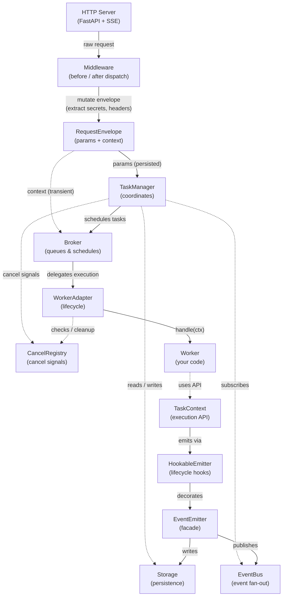

# a2akit

[](https://pypi.org/project/a2akit/)
[](LICENSE)
[](https://pypi.org/project/a2akit/)
[](https://github.com/Coding-Crashkurse/a2a-kit/actions)

**A2A agent framework in one import.**

Build [Agent-to-Agent (A2A)](https://google.github.io/A2A/) protocol
agents with minimal boilerplate. Streaming, cancellation, multi-turn
conversations, and artifact handling — batteries included.

## Install

```bash
pip install a2akit
```

With optional LangGraph support:

```bash
pip install a2akit[langgraph]
```

## Quick Start

```python
from a2akit import A2AServer, AgentCardConfig, TaskContext, Worker


class EchoWorker(Worker):
    async def handle(self, ctx: TaskContext) -> None:
        await ctx.complete(f"Echo: {ctx.user_text}")


server = A2AServer(
    worker=EchoWorker(),
    agent_card=AgentCardConfig(
        name="Echo Agent",
        description="Echoes your input back.",
        version="0.1.0",
    ),
)
app = server.as_fastapi_app()
```

Run it:

```bash
uvicorn my_agent:app --reload
```

Test it:

```bash
curl -X POST http://localhost:8000/v1/message:send \
  -H "Content-Type: application/json" \
  -d '{"message":{"role":"user","parts":[{"text":"hello"}],"messageId":"1"}}'
```

## Features

- **One-liner setup** — `A2AServer` wires storage, broker, event bus, and endpoints
- **Middleware** — `A2AMiddleware` pipeline for auth extraction, header injection, payload sanitization, and logging
- **Streaming** — word-by-word artifact streaming via SSE
- **Cancellation** — cooperative and force-cancel with timeout fallback
- **Multi-turn** — `request_input()` / `request_auth()` for conversational flows
- **Direct reply** — `reply_directly()` for simple request/response without task tracking
- **Lifecycle hooks** — fire-and-forget callbacks on terminal state transitions
- **Pluggable backends** — swap in Redis, PostgreSQL, RabbitMQ (coming soon)
- **Type-safe** — full type hints, `py.typed` marker, PEP 561 compliant

## Architecture

a2akit allows you to bring your own `Storage`, `Broker`, `EventBus`,
`CancelRegistry` and `Worker`. You can also leverage the in-memory implementations
for development.



**TaskManager** handles submission, validation, streaming, and cancellation. It coordinates
between Broker, Storage, EventBus, and CancelRegistry — but never touches the Worker
directly.

**WorkerAdapter** bridges the Broker queue to your Worker. It manages the lifecycle:
dequeue -> check cancel -> build context -> transition to `working` -> call `handle(ctx)` ->
cleanup.

**EventEmitter** is the facade that TaskContext uses to persist state (Storage) and broadcast
events (EventBus) without knowing about either directly. Storage writes are authoritative;
EventBus is best-effort.

**Middleware** intercepts requests at the HTTP boundary. `before_dispatch` runs before
TaskManager sees the request — extract secrets from `message.metadata`, read HTTP headers,
sanitize payloads. `after_dispatch` runs after TaskManager returns — log timing, emit
metrics, clean up. Transient data lives in `RequestEnvelope.context` and flows through
the Broker to the Worker via `ctx.request_context`, but is **never persisted** in Storage.

**Pluggable backends:** Swap `Storage`, `Broker`, `EventBus`, and `CancelRegistry`
independently — e.g. PostgreSQL storage + Redis broker + Redis event bus. All backends
implement their respective ABC.

## TaskContext API

`TaskContext` is the only interface your worker needs. It abstracts away all A2A protocol details:

### Properties

| Property | Description |
|---|---|
| `ctx.user_text` | The user's input as plain text |
| `ctx.parts` | Raw message parts (text, files, etc.) |
| `ctx.files` | File parts as `list[FileInfo]` (content, url, filename, media_type) |
| `ctx.data_parts` | Structured data parts as `list[dict]` |
| `ctx.task_id` | Current task UUID |
| `ctx.context_id` | Conversation / context identifier |
| `ctx.message_id` | ID of the triggering message |
| `ctx.metadata` | Arbitrary metadata from the request (persisted) |
| `ctx.request_context` | Transient data from middleware (never persisted) |
| `ctx.is_cancelled` | Check if cancellation was requested |
| `ctx.turn_ended` | Whether a terminal method was called |
| `ctx.history` | Previous messages in this task (`list[HistoryMessage]`) |
| `ctx.previous_artifacts` | Artifacts from prior turns (`list[PreviousArtifact]`) |

### Lifecycle

| Method | Description |
|---|---|
| `ctx.complete(text?)` | Mark task completed with optional text artifact |
| `ctx.complete_json(data)` | Complete with a JSON data artifact |
| `ctx.respond(text?)` | Complete with a direct message (no artifact) |
| `ctx.reply_directly(text)` | Return a Message directly without task tracking |
| `ctx.fail(reason)` | Mark task failed |
| `ctx.reject(reason?)` | Reject the task |
| `ctx.request_input(question)` | Ask user for more input |
| `ctx.request_auth(details?)` | Request secondary authentication |

### Streaming

| Method | Description |
|---|---|
| `ctx.send_status(msg)` | Emit intermediate status update |
| `ctx.emit_text_artifact(...)` | Emit a text artifact chunk |
| `ctx.emit_data_artifact(data)` | Emit a structured data artifact chunk |
| `ctx.emit_artifact(...)` | Emit an artifact with any content (text, data, file_bytes, file_url) |

### Context

| Method | Description |
|---|---|
| `ctx.load_context()` | Load stored context for this conversation |
| `ctx.update_context(data)` | Store context for this conversation |

No `Part(root=TextPart(...))`. No `EventQueue`. No `TaskUpdater`. Just call methods.

## Streaming Example

```python
import asyncio
from a2akit import A2AServer, AgentCardConfig, TaskContext, Worker


class StreamingWorker(Worker):
    async def handle(self, ctx: TaskContext) -> None:
        words = ctx.user_text.split()
        await ctx.send_status(f"Streaming {len(words)} words...")

        for i, word in enumerate(words):
            is_last = i == len(words) - 1
            await ctx.emit_text_artifact(
                text=word + ("" if is_last else " "),
                artifact_id="stream",
                append=(i > 0),
                last_chunk=is_last,
            )
            await asyncio.sleep(0.1)

        await ctx.complete()


server = A2AServer(
    worker=StreamingWorker(),
    agent_card=AgentCardConfig(
        name="Streamer",
        description="Word-by-word streaming",
        version="0.1.0",
    ),
)
app = server.as_fastapi_app()
```

## Middleware

Middleware operates on a `RequestEnvelope` at the HTTP boundary, separating
transient request data (tokens, headers) from the persisted A2A protocol payload.

```python
from a2akit import A2AMiddleware, A2AServer, AgentCardConfig, RequestEnvelope, TaskContext, Worker
from fastapi import Request


class SecretExtractor(A2AMiddleware):
    """Move sensitive keys from message.metadata into transient context."""

    SECRET_KEYS = {"user_token", "api_key", "auth_token"}

    async def before_dispatch(self, envelope: RequestEnvelope, request: Request) -> None:
        msg_meta = envelope.params.message.metadata or {}
        for key in self.SECRET_KEYS & msg_meta.keys():
            envelope.context[key] = msg_meta.pop(key)
        if auth := request.headers.get("Authorization"):
            envelope.context["auth_header"] = auth


class MyWorker(Worker):
    async def handle(self, ctx: TaskContext) -> None:
        # Transient — never in Storage
        token = ctx.request_context.get("user_token")
        # Persisted — from message.metadata
        trace_id = ctx.metadata.get("trace_id")

        result = await call_external_api(token)
        await ctx.complete(f"Result: {result}")


server = A2AServer(
    worker=MyWorker(),
    agent_card=AgentCardConfig(name="My Agent", description="...", version="0.1.0"),
    middlewares=[SecretExtractor()],
)
app = server.as_fastapi_app()
```

**Execution order:** `before_dispatch` runs in registration order;
`after_dispatch` runs in reverse (like Python context managers).

## Lifecycle Hooks

Register callbacks that fire after terminal state transitions (completed, failed,
canceled, rejected). Hooks are fire-and-forget — errors are logged and swallowed,
never affecting task processing.

```python
import logging

from a2a.types import Message, TaskState

from a2akit import A2AServer, AgentCardConfig, TaskContext, Worker
from a2akit.hooks import LifecycleHooks

logger = logging.getLogger(__name__)


async def on_terminal(task_id: str, state: TaskState, message: Message | None) -> None:
    """Called once per task when it reaches a terminal state."""
    if state == TaskState.completed:
        logger.info("Task %s completed successfully", task_id)
    elif state == TaskState.failed:
        logger.warning("Task %s failed: %s", task_id, message)
    elif state == TaskState.canceled:
        logger.info("Task %s was canceled", task_id)


class MyWorker(Worker):
    async def handle(self, ctx: TaskContext) -> None:
        await ctx.complete(f"Done: {ctx.user_text}")


server = A2AServer(
    worker=MyWorker(),
    agent_card=AgentCardConfig(name="Hooked Agent", description="...", version="0.1.0"),
    hooks=LifecycleHooks(on_terminal=on_terminal),
)
app = server.as_fastapi_app()
```

Hooks fire after a successful Storage write. If the write fails (e.g.
`TaskTerminalStateError` from a concurrent cancel), the hook does not fire.
The Storage terminal-state guard provides exactly-once delivery per task.

## Configuration

a2akit reads settings from environment variables prefixed with `A2AKIT_`.
Every setting has a sensible default; explicit constructor parameters always
take priority.

| Variable                        | Default  | Purpose                                      |
|---------------------------------|----------|----------------------------------------------|
| `A2AKIT_BLOCKING_TIMEOUT`       | `30.0`   | Seconds `message:send` blocks for a result   |
| `A2AKIT_CANCEL_FORCE_TIMEOUT`   | `60.0`   | Seconds before force-cancel kicks in          |
| `A2AKIT_MAX_CONCURRENT_TASKS`   | *(none)* | Worker parallelism (`None` = unlimited)       |
| `A2AKIT_MAX_RETRIES`            | `3`      | Broker retry attempts on worker crash         |
| `A2AKIT_BROKER_BUFFER`          | `1000`   | InMemoryBroker queue depth                    |
| `A2AKIT_EVENT_BUFFER`           | `200`    | InMemoryEventBus fan-out buffer per task      |
| `A2AKIT_LOG_LEVEL`              | *(unset)*| Root `a2akit` logger level (e.g. `DEBUG`)     |

**Priority:** constructor parameter > environment variable > built-in default.

**Example:**

    export A2AKIT_BLOCKING_TIMEOUT=10
    export A2AKIT_LOG_LEVEL=DEBUG
    export A2AKIT_MAX_CONCURRENT_TASKS=4

**Programmatic override:**

    from a2akit import A2AServer, Settings

    custom = Settings(blocking_timeout=5.0, max_retries=5)
    server = A2AServer(worker=..., agent_card=..., settings=custom)

## A2AServer Configuration

```python
server = A2AServer(
    worker=MyWorker(),
    agent_card=AgentCardConfig(
        name="My Agent",
        description="What your agent does.",
        version="0.1.0",
    ),
    middlewares=[SecretExtractor()],  # optional middleware pipeline
    storage="memory",                # or pass a Storage instance
    broker="memory",                 # or pass a Broker instance
    event_bus="memory",              # or pass an EventBus instance
    cancel_registry=None,            # or pass a CancelRegistry instance
    blocking_timeout_s=30.0,         # timeout for blocking requests
    max_concurrent_tasks=None,       # limit parallel task execution
    hooks=LifecycleHooks(...),       # optional lifecycle hooks
)
app = server.as_fastapi_app()
```

## Endpoints

| Method | Path | Description |
|---|---|---|
| POST | `/v1/message:send` | Submit a message, return task or direct reply |
| POST | `/v1/message:stream` | Submit a message, stream events via SSE |
| GET | `/v1/tasks/{task_id}` | Get a single task by ID |
| GET | `/v1/tasks` | List tasks with filters and pagination |
| POST | `/v1/tasks/{task_id}:cancel` | Cancel a task |
| POST | `/v1/tasks/{task_id}:subscribe` | Subscribe to task updates via SSE |
| GET | `/v1/health` | Health check |
| GET | `/.well-known/agent-card.json` | Agent discovery card |

## A2A Protocol Version

a2akit implements [A2A v0.3.0](https://google.github.io/A2A/).

## Roadmap

Planned features for upcoming releases. Priorities may shift based on feedback.

| Feature | Target |
|---|---|
| ~~Request middleware~~ | ~~v0.1.0~~ done |
| ~~Lifecycle hooks~~ | ~~v0.1.0~~ done |
| Dependency injection | v0.1.0 |
| Documentation website | v0.1.0 |
| Redis EventBus | v0.2.0 |
| Redis Broker | v0.2.0 |
| PostgreSQL Storage | v0.2.0 |
| SQLite Storage | v0.2.0 |
| Backend conformance test suite | v0.2.0 |
| OpenTelemetry integration | v0.2.0 |
| RabbitMQ Broker | v0.3.0+ |
| JSON-RPC transport | v0.3.0+ |
| gRPC transport | v0.4.0+ |

This roadmap is subject to change.

## License

MIT
