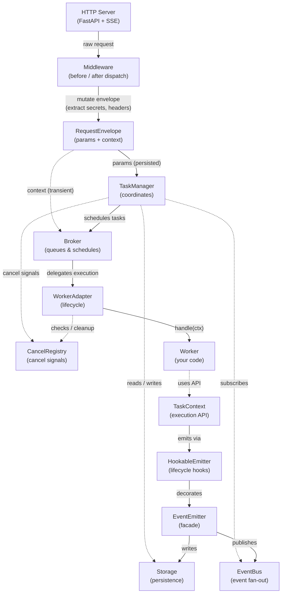

# Architecture

a2akit is built around pluggable components that you can swap independently. Every component implements an ABC, and in-memory defaults are provided for local development.

## Component Diagram

## Data Flow

A request flows through the system in this order:

1. **HTTP Request** arrives at a FastAPI endpoint (`/v1/message:send` or `/v1/message:stream`).
2. **Middleware** pipeline runs `before_dispatch` on a `RequestEnvelope`, extracting secrets and enriching transient context.
3. **TaskManager** receives the protocol params, creates or updates the task in Storage, and enqueues a run operation on the Broker.
4. **Broker** delivers the operation to the **WorkerAdapter**.
5. **WorkerAdapter** builds a `TaskContext`, transitions the task to `working`, and calls your **Worker**'s `handle(ctx)` method.
6. **Worker** uses `TaskContext` methods to emit artifacts, status updates, and lifecycle transitions. These flow through the **EventEmitter** to Storage (authoritative write) and EventBus (best-effort broadcast).

## Components

### TaskManager

Handles submission, validation, streaming, and cancellation. Coordinates between Broker, Storage, EventBus, and CancelRegistry — but never touches the Worker directly.

### WorkerAdapter

Bridges the Broker queue to your Worker. Manages the lifecycle: dequeue, check cancel, build context, transition to `working`, call `handle(ctx)`, cleanup.

### EventEmitter

Facade that TaskContext uses to persist state (Storage) and broadcast events (EventBus) without knowing about either directly.

### HookableEmitter

Decorator around EventEmitter that fires lifecycle hooks after successful state transitions. See [Lifecycle Hooks](../guides/hooks.md).

### Storage

Authoritative persistence layer for tasks, artifacts, and messages. Handles CRUD and data-integrity constraints (terminal-state guard, optimistic concurrency). See [Storage Reference](../reference/storage.md).

### Broker

Task queue that schedules and delivers run operations to WorkerAdapter. Handles retry logic with ack/nack semantics. See [Broker Reference](../reference/broker.md).

### EventBus

1:N event fan-out for SSE streaming. Publishes task status updates and artifact events to all subscribers. Best-effort delivery — if a publish fails, the state is still correct in Storage. See [EventBus Reference](../reference/eventbus.md).

### CancelRegistry

Tracks cancellation signals per task. The worker checks `ctx.is_cancelled` cooperatively, and `TaskManager` has a force-cancel timeout fallback. See [Cancellation Guide](../guides/cancellation.md).

### Middleware

Intercepts requests at the HTTP boundary. `before_dispatch` runs before TaskManager sees the request; `after_dispatch` runs after. See [Middleware Guide](../guides/middleware.md).

## Design Principles

**Storage is authoritative; EventBus is best-effort.** If an EventBus publish fails, the task state is still correct in Storage. Clients polling via GET will always see the right state. SSE subscribers may miss intermediate events but will always see the final status.

**Pluggable backends.** Swap Storage, Broker, EventBus, and CancelRegistry independently — e.g. PostgreSQL storage + Redis broker + Redis event bus. All backends implement their respective ABC. Pass `broker="redis://..."` and `event_bus="redis://..."` to `A2AServer` for multi-process deployments.

**Worker isolation.** Your Worker only sees `TaskContext`. It doesn't know about Storage, Broker, or EventBus. This makes workers easy to test and portable across backend configurations.
